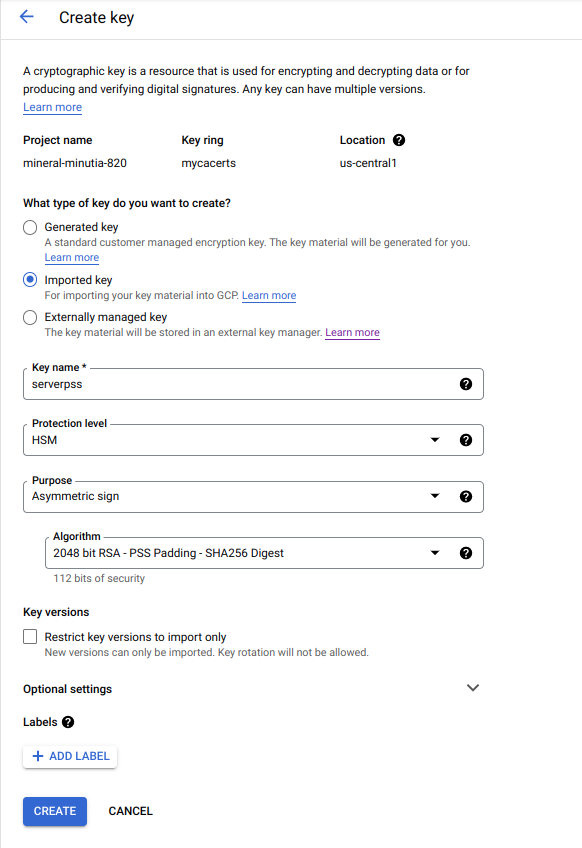
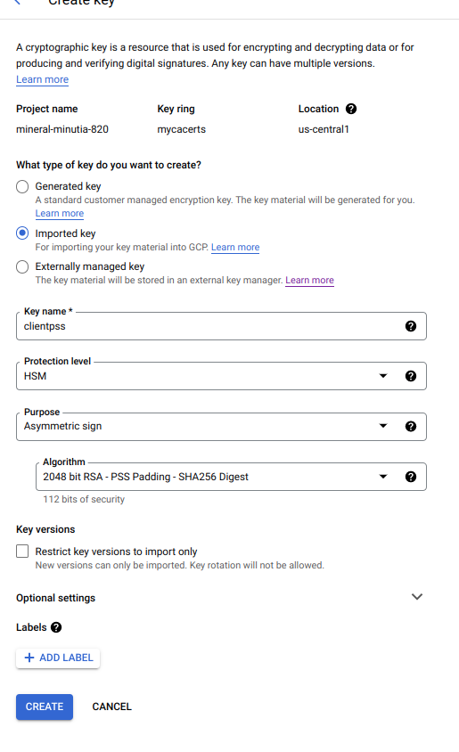
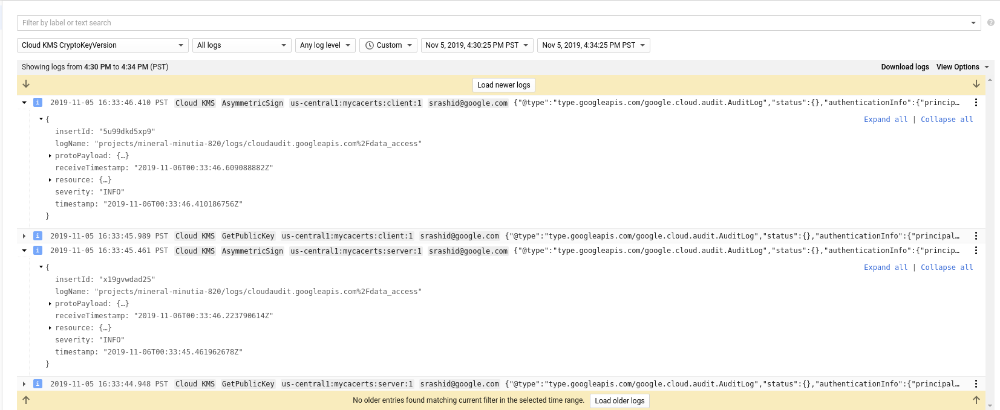

# mTLS with Google Cloud KMS

A couple weeks back I hacked golang's [crypto.Signer](https://golang.org/pkg/crypto/#Signer) and [crypto.Decrypter](https://golang.org/pkg/crypto/#Decrypter) interface to the `Trusted Platform Module (TPM)` go interface i've been working with lately.  While working with that, I knew you can seal a key to a TPM and make it sign for some data just like with KMS...I knew TLS connections primarily use signatures during the exchange so i thought: _is there anyway to add a signer interface to [go-tpm](https://github.com/google/go-tpm) such that i can use the key in the TPM with SSL_?  Yep, that involves having something implement the `crypto.Signer` interface (mostly).

The implementation i have for that is just a hack [here](https://github.com/salrashid123/misc/blob/master/tpm/tpm.go) (i'm waiting for it get included officially to go-tpm)

So...coming back to KMS..this repo is an extension of that idea where you can run an HTTPs server and client where the private keys are save in KMS.

(yes, i know, latency, practicality etc but this is (at the moment) for amusement so..)

At a high level, you use your `CA` (wherever it is), to define  a set of keypairs for an HTTPS `server` and `client`.  You then embed the certs into [Cloud KMS](https://cloud.google.com/kms/) with just RSA sign capability and then restrict access to those keys via IAM.

The HTTPS sever has credentials to access the server key to only Sign.  The client has credentials to the client key to only sign.  If you define a golang `TLSConfig` provider that implements the `crypto.Singer` capability, the standard golang `net/http` module will delegate the crypto operations to your implementation. In ourcase the `Sign()` request coming for the go library inturn just makes a cloud KMS api call...thats it.

You ofcourse don't need to run mTLS here..you can just use KMS for one direction of the session.

>> Note: if it wasn't clear: this repo is _not_ supported by Google

### crypto.Signer, crypto.Decrypter Implementation for KMS

At the heart of all this is the wrapper implementation i hacked here that wraps KMS api calls with the `Signer`

- [https://github.com/salrashid123/misc/blob/master/kms/kms.go](https://github.com/salrashid123/misc/blob/master/kms/kms.go)


So a sample sever for TLS looks prettymuch like what you'd expect anyway

```golang
package main

import (
	"crypto/x509"
	"fmt"
	"io/ioutil"
	"log"
	"net/http"
	sal "github.com/salrashid123/misc/kms"
	"crypto/tls"
	"golang.org/x/net/http2"
)

const (
	projectID = "foo"
)

var ()

func fronthandler(w http.ResponseWriter, r *http.Request) {
	log.Println("/ called")
	fmt.Fprint(w, "ok")
}


func main() {

	caCert, err := ioutil.ReadFile("CA_crt.pem")
	caCertPool := x509.NewCertPool()
	caCertPool.AppendCertsFromPEM(caCert)

	r := &sal.KMS{
		PublicKeyFile: "server.crt",
		ProjectId:     projectID,
		LocationId:    "us-central1",
		KeyRing:       "mycacerts",
		Key:           "server",
		KeyVersion:    "1",
		RootCAs:       caCertPool,
	}

	http.HandleFunc("/", fronthandler)

	var server *http.Server
	server = &http.Server{
		Addr:      ":8081",
		TLSConfig: r.NewTLSConfig(),
	}
	http2.ConfigureServer(server, &http2.Server{})
	log.Println("Starting Server..")
	err = server.ListenAndServeTLS("", "")
	log.Fatalf("Unable to start Server %v", err)
}
```

Notes:
- Yes, i didn't implement all the parameters for the `TlSConfig`...but its enough to make it work for now
- Yes, i should not create new KMS clients everytime (don't be lazy, sal)
- Yes, why do this anyway? (see the bottom of the repo)

---

Anyway, if you're still interested: 

### Generate local CA

First we need to generate a CA an certificates we want to import.  The following describes the basic flow derived from a prior article [here](https://github.com/salrashid123/squid_proxy#generating-new-ca) to create a CA, a set of server and client certificates.  We are defining the server cert to have 'CN=localhost` but you are free to define wherever you with to host the service


```bash
cd myCA
mkdir new_certs
touch index.txt
echo 00 > serial

openssl genrsa -out CA_key.pem 2048
openssl req -x509 -days 600 -new -nodes -key CA_key.pem -out CA_crt.pem -extensions v3_ca -config openssl.conf    -subj "/C=US/ST=California/L=Mountain View/O=Google/OU=Enterprise/CN=MyCA"


openssl genrsa -out server.key 2048
openssl req -config openssl.conf -days 400 -out server.csr -key server.key -new -sha256  -extensions v3_req  -subj "/C=US/ST=California/L=Mountain View/O=Google/OU=Enterprise/CN=localhost"
openssl ca -config openssl.conf -days 400 -notext  -in server.csr   -out server.crt

 openssl x509 -in server.crt  -noout -pubkey  > server.pem


openssl genrsa -out client.key 2048
openssl req -config openssl.conf -days 400 -out client.csr -key client.key -new -sha256  -extensions v3_req  -subj "/C=US/ST=California/L=Mountain View/O=Google/OU=Enterprise/CN=client"
openssl ca -config openssl.conf -days 400 -notext  -in client.csr   -out client.crt
```

You'll be left with the following:

* Server
  - `server.crt`: x509 public certificate
  - `server.pem`: RSA public key
  - `server.key`: private key

* Client
  - `client.crt`: x509 public key
  - `client.key`: private key

Copy these files to the root folder of this repo.

### Create KMS KeyRing and ImportJob

First step is to setup the keyring itself:

https://cloud.google.com/kms/docs/importing-a-key

```bash
export LOCATION=us-central1
export KEYRING_NAME=mycacerts
export IMPORT_JOB=certimporter
export VERSION=1

gcloud kms keyrings create $KEYRING_NAME --location $LOCATION

gcloud beta kms import-jobs create $IMPORT_JOB \
  --location $LOCATION \
  --keyring $KEYRING_NAME \
  --import-method rsa-oaep-3072-sha1-aes-256 \
  --protection-level hsm
```
### Create import keys on Cloud console

On the cloud console, navigate to the KMS key cited above and simply define the `server` and `client` as shown below.  You do _not_ need to import anything yet; we will format and use gcloud shortly. 

Remember while defining the keys, specify

* `Asymmetric Sign`:  
* `2048 bit RSA key PKCS#1 v1.5 padding - SHA256 Digest`
* Select _"Import Key Material"_
* Click the "Create" button but _do not_ import anything (we ill do that later in the next step; simply navigate back)





### Format private keys for import

We need to [format the keys](https://cloud.google.com/kms/docs/formatting-keys-for-import) for importing into the HSM as described in:

```bash
openssl pkcs8 -topk8 -nocrypt -inform PEM -outform DER  -in server.key -out server_formatted.key
openssl pkcs8 -topk8 -nocrypt -inform PEM -outform DER  -in client.key -out client_formatted.key
```

### Import the keys into the HSM

```bash
gcloud beta kms keys versions import --import-job $IMPORT_JOB --location $LOCATION   --keyring $KEYRING_NAME   --key server   --algorithm rsa-sign-pkcs1-2048-sha256  --target-key-file  server_formatted.key

gcloud beta kms keys versions import --import-job $IMPORT_JOB --location $LOCATION   --keyring $KEYRING_NAME   --key client   --algorithm rsa-sign-pkcs1-2048-sha256  --target-key-file  client_formatted.key
```

You may need to install the cryptography package and force gcloud to use the sitepackages

```bash
pip install --user cryptography
export CLOUDSDK_PYTHON_SITEPACKAGES=1
```

You can verify the status of the import job by running.  When the job is completed, you should see `state: ENABLED`

```bash
gcloud kms keys versions describe $VERSION \
  --location $LOCATION \
  --keyring $KEYRING_NAME \
  --key server
```

>> At this point, you can delete `server.key` and `client.key` private keys as its now save(er) inside KMS.

### Specify IAM permission on the keys for 

If you are running this tutorial somewhere you  are already authenticated via application default credentials, you should already have IAM permissions inherited. If not, for each key you've just defined, assign the `Cloud KMS CryptoKey Signer` role to the account that will run the client and server

### Run mTLS Server

Edit `src/server_kms/main.go` and set the `projectID` const variable.

```
export GOPATH=$GOPATH:`pwd`

go run src/server_kms/main.go
```

You'll need to `go get` all the libraries missing (sorry, i didn't use gomodules)
  eg: `golang.org/x/oauth2/google google.golang.org/api/cloudkms/v1 github.com/salrashid123/misc/kms`

### Run mTLS Client

Edit `src/client/main.go` and set the `projectID` const variable.

```
export GOPATH=$GOPATH:`pwd`

go run src/client/main.go
```

What you should see is a simple ok...but what that shows is mTLS between the client and server where the private keys used to make the mTLS connection is hosted on cloud KMS...


## AuditLogs

If you enabled auditlogs for KMS, you will see both the client and server request a sign API request on either side to establish the mTLS connection



## Issues, issues

#### Latency

Well...yeah, there is some and thats one of the biggest reasons this is a bit academic.  I ran this setup a couple times and saw that the API calls from my laptop to establish just a TLS connection using one KMS key added on about `150ms`...This would be faster on a compute engine or on GKE on cloud though...but its still a lot.

#### Authentication

The permission to even access the KMS keys to do anything requires bootstrapping `Application Default Credentials`...which means the system will need some context to do anything.  The example here used my own user account but you can use a serviceAccount credential, GCE Metadata server...or later on what is i've been working on here is the Trusted Platform Module that saves the credentials.

- [TPM2-TSS-Engine hello world and Google Cloud Authentication](https://github.com/salrashid123/tpm2_evp_sign_decrypt)
- [TPM crypto.Signer](https://github.com/salrashid123/misc/blob/master/tpm/tpm.go)
- [Trusted Platform Module (TPM) recipes with tpm2_tools and go-tpm](https://github.com/salrashid123/tpm2)

#### Why do all this anyway?

I'm not sure at the moment...

---


## Appendix

### Using crypto.Decrypter

If you want to test crypto.Decryptor, assign `Cloud KMS CryptoKey Decrypter` role and uncomment.  You will need to create a _new_ keypair using your CA (call it `decrypter`) and follow the procedure above.  The distiction here is that while you define the key in KMS, st it to Decrypt (not sign)

```golang

	publicKeyFile := "decrypter.pem"
	publicPEM, err := ioutil.ReadFile(publicKeyFile)
	if err != nil {
		log.Fatalf("Unable to read keys %v", err)
	}
	pubKeyBlock, _ := pem.Decode((publicPEM))
	ifc, err := x509.ParsePKIXPublicKey(pubKeyBlock.Bytes)
	if err != nil {
		log.Fatal(err)
	}
	pkey, ok := ifc.(*rsa.PublicKey)
	if !ok {
		log.Fatal("Unable to extract PublicKey")
	}
	hash := sha256.New()
	msg := []byte("foo")
	ciphertext, err := rsa.EncryptOAEP(hash, rand.Reader, pkey, msg, nil)
	if err != nil {
		log.Fatalln(err)
	}
	log.Printf("Encrypted Data: %v", base64.StdEncoding.EncodeToString(ciphertext))

	r := &sal.KMS{
		ProjectId:  "mineral-minutia-820",
		LocationId: "us-central1",
		KeyRing:    "mycacerts",
		Key:        "decrypter",
		KeyVersion: "1",
	}
	plaintext, err := r.Decrypt(rand.Reader, ciphertext, nil)
	if err != nil {
		log.Fatal(err)
	}
	log.Printf("Decrypted Data: %v ", string(plaintext))
  
```