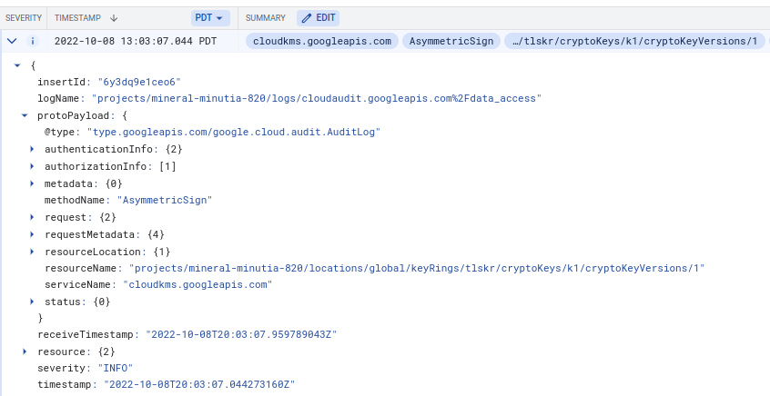

# mTLS with Google Cloud KMS

This article demonstrates how you can use a [crypto.Signer](https://github.com/salrashid123/signer) implementation i wrote some years ago to make an mTLS connection using a private key that exists only in GCP KMS.

Basically, you will create a KMS key that is enabled for `RSA-PSS` or `ECDSA` Signing. 

We will then issue a `Certificate Signing Request (csr)` using the private key to sign the request.

From there, we have a local Certificate Authority that will issue the `x509` cert for the client.

We will then run an https server that requires client certificates issued by that same CA

The client will use the client `x509` and KMS private key reference to establish an mTLS connection to the server.

---

>> Note: if it wasn't clear: this repo is _not_ supported by Google


For more information, see 

* [crypto.Signer, implementations for Google Cloud KMS and Trusted Platform Modules](https://github.com/salrashid123/signer)
* [mTLS with PKCS11](https://github.com/salrashid123/mtls_pkcs11)
* [mTLS with TPM bound private key](https://github.com/salrashid123/go_tpm_https_embed)

---

#### Create KMS Key
First create a KMS key

```bash
export GCLOUD_USER=`gcloud config get-value core/account`

gcloud kms keyrings create tlskr --location=global

gcloud kms keys create k1 --keyring=tlskr \
   --location=global --purpose=asymmetric-signing \
   --default-algorithm=rsa-sign-pss-2048-sha256

gcloud kms keys add-iam-policy-binding k1  \
     --keyring=tlskr --location=global   \
	   --member=user:$GCLOUD_USER  --role=roles/cloudkms.signer

gcloud kms keys add-iam-policy-binding k1  \
     --keyring=tlskr --location=global   \
	   --member=user:$GCLOUD_USER  --role=roles/cloudkms.viewer
```


```bash
$ gcloud kms keys list --keyring=tlskr --location=global
NAME                                                                        PURPOSE          ALGORITHM                 PROTECTION_LEVEL 
projects/PROJECT/locations/global/keyRings/tlskr/cryptoKeys/k1  ASYMMETRIC_SIGN  RSA_SIGN_PSS_2048_SHA256  SOFTWARE
```

recall the public key (your's will ofcourse be different)

```bash
$ gcloud kms keys versions get-public-key 1    --key=k1 --keyring=tlskr   --location=global
-----BEGIN PUBLIC KEY-----
MIIBIjANBgkqhkiG9w0BAQEFAAOCAQ8AMIIBCgKCAQEAzHdXnqlUgvFlTaAXBMAU
cxi74Vfb0tA7Pn/356xIqB820t6bSRmCutPOnHUYz02piNFJP2Vx+HKiqmT3S7jy
Yv6xPWxGfOHmKbwl8UkMzOdPtTyMLk11TSGA0Wgar9e/chU1UxH1Rk9sQ5CG8xBK
7ToGGIn0fxBvyWeAucsgn3PONuuqrKsTfW/hckyk866oI8e8C7+XWrbtM6gBt4/U
Z2OiF/QfdoXB4oBFLi+NHkLdYBk0pM6R/xaXCGUchLQkfw6MdD68MvfNVSY7YIuy
g5ZIrWFQzSptCtn4mF9CLooRK/2d360d9hsCUybCTRAw6D8Ra27aVS5+Vl+lajxu
JQIDAQAB
-----END PUBLIC KEY-----
```

### Create a CSR

now create a CSR:

```bash
export PROJECT_ID=`gcloud config get-value core/project`

cd csr/

go run main.go --projectID=$PROJECT_ID --cn client.domain.com --filename ../certs/client.csr
```

### Sign CSR

Then initialize the CA using the certificate authority here (you can create you own CA [here](https://github.com/salrashid123/ca_scratchpad)).


```bash
cd certs/

rm -rf /tmp/kmsca
mkdir -p /tmp/kmsca

cp /dev/null /tmp/kmsca/tls-ca.db
cp /dev/null /tmp/kmsca/tls-ca.db.attr

echo 01 > /tmp/kmsca/tls-ca.crt.srl
echo 01 > /tmp/kmsca/tls-ca.crl.srl


openssl ca \
    -config tls-ca.conf \
    -in client.csr \
    -out client.crt \
    -extensions client_ext
```

You can also confirm the certificate has the same public key from KMS

```bash
$ openssl x509 -pubkey -noout -in client.crt 
-----BEGIN PUBLIC KEY-----
MIIBIjANBgkqhkiG9w0BAQEFAAOCAQ8AMIIBCgKCAQEAzHdXnqlUgvFlTaAXBMAU
cxi74Vfb0tA7Pn/356xIqB820t6bSRmCutPOnHUYz02piNFJP2Vx+HKiqmT3S7jy
Yv6xPWxGfOHmKbwl8UkMzOdPtTyMLk11TSGA0Wgar9e/chU1UxH1Rk9sQ5CG8xBK
7ToGGIn0fxBvyWeAucsgn3PONuuqrKsTfW/hckyk866oI8e8C7+XWrbtM6gBt4/U
Z2OiF/QfdoXB4oBFLi+NHkLdYBk0pM6R/xaXCGUchLQkfw6MdD68MvfNVSY7YIuy
g5ZIrWFQzSptCtn4mF9CLooRK/2d360d9hsCUybCTRAw6D8Ra27aVS5+Vl+lajxu
JQIDAQAB
-----END PUBLIC KEY-----
```

#### Run Server

Now run the TLS Server

```bash
cd example/
go run server/main.go
```

### Run Client

```bash
cd example
go run client/client.go --projectID $PROJECT_ID
```

Once you connect, the server will show the peer certificate's public key it recieved....and surprise, its the one that matches our KMS public key

```
-----BEGIN PUBLIC KEY-----
MIIBIjANBgkqhkiG9w0BAQEFAAOCAQ8AMIIBCgKCAQEAzHdXnqlUgvFlTaAXBMAU
cxi74Vfb0tA7Pn/356xIqB820t6bSRmCutPOnHUYz02piNFJP2Vx+HKiqmT3S7jy
Yv6xPWxGfOHmKbwl8UkMzOdPtTyMLk11TSGA0Wgar9e/chU1UxH1Rk9sQ5CG8xBK
7ToGGIn0fxBvyWeAucsgn3PONuuqrKsTfW/hckyk866oI8e8C7+XWrbtM6gBt4/U
Z2OiF/QfdoXB4oBFLi+NHkLdYBk0pM6R/xaXCGUchLQkfw6MdD68MvfNVSY7YIuy
g5ZIrWFQzSptCtn4mF9CLooRK/2d360d9hsCUybCTRAw6D8Ra27aVS5+Vl+lajxu
JQIDAQAB
-----END PUBLIC KEY-----
```

## ECDSA Keys

for ecc keys, crate `k2`

```bash
gcloud kms keys create k2 --keyring=tlskr \
   --location=global --purpose=asymmetric-signing    --default-algorithm=ec-sign-p256-sha256

gcloud kms keys add-iam-policy-binding k2  \
        --keyring=tlskr --location=global  \
        --member=user:$GCLOUD_USER  --role=roles/cloudkms.signer

gcloud kms keys add-iam-policy-binding k2 \
        --keyring=tlskr --location=global  \
        --member=user:$GCLOUD_USER  --role=roles/cloudkms.viewer

gcloud kms keys list --keyring=tlskr --location=global
NAME                                                                  PURPOSE          ALGORITHM                 PROTECTION_LEVEL  LABELS  PRIMARY_ID  PRIMARY_STATE
projects/srashid-test2/locations/global/keyRings/tlskr/cryptoKeys/k1  ASYMMETRIC_SIGN  RSA_SIGN_PSS_2048_SHA256  SOFTWARE
projects/srashid-test2/locations/global/keyRings/tlskr/cryptoKeys/k2  ASYMMETRIC_SIGN  EC_SIGN_P256_SHA256       SOFTWARE
```

Then edit `csr/main.go` and `example/client/client.go` and uncomment the ecdsa signing section


## AuditLogs

If you enabled auditlogs for KMS, you will see both the csr and client request a sign API request on either side to establish the mTLS connection




## Issues, issues

#### Latency

Well...yeah, there is some and thats one of the biggest reasons this is a bit academic.  I ran this setup a couple times and saw that the API calls from my laptop to establish just a TLS connection using one KMS key added on about `150ms`...This would be faster on a compute engine or on GKE on cloud though...but its still a lot.

#### Costs

yah, that too..you're making an api call for each mtls connection..